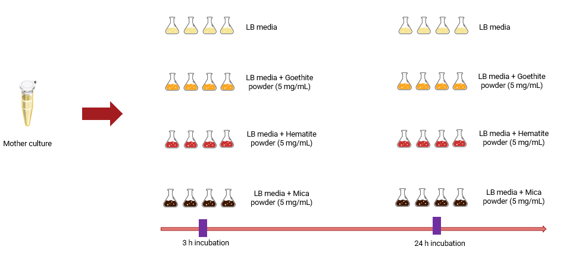

# Prepare data

## Bioinformatics

### Get data

```{sh get_genome, warning=FALSE, comments="", message=FALSE, eval=FALSE}
mkdir genome
wget -P genome https://ftp.ncbi.nlm.nih.gov/genomes/all/GCF/000/009/045/GCF_000009045.1_ASM904v1/GCF_000009045.1_ASM904v1_genomic.fna.gz
```

```{sh get_reads, warning=FALSE, comments="", message=FALSE, eval=FALSE}
mkdir reads
# fetch data from ERDA
```

### Run annotation and profiling

```{sh run_annotation, warning=FALSE, comments="", message=FALSE, eval=FALSE}
drakkar annotating -b genome
drakkar expressing -b genome -r reads
```

### Experimental design

This project consists of 40 RNAseq samples. Twenty samples were collected at 3 h and the remaining 20 at 24 h. The experiment includes one control group (C) and three treatment groups, in which bacteria were exposed to 5 mg/mL of the following minerals: goethite (G), hematite (H) and mica (M). 

Each condition includes 4 biological replicates for which RNA was extracted using the [ZymoBIOMICS RNA Kit](https://zymoresearch.eu/products/zymobiomics-rna-miniprep-kit?srsltid=AfmBOop0gFSEZIxc0EIYXblZ3PRZIOI1UsrI-na74bpEhqRX3qm2ma1p), and one replicate for which RNA was extracted using the DREX protocol.



### Get working files

- gene_annotations.tsv.xz
- gene_counts.tsv.xz

## Load data

Samples have been split in different lanes during sequencing so gene_counts.tsv.xz has more columns that what is expected for the conditions of the experiments (40 different samples). 


```{r load_reads, warning=FALSE, comments="", message=FALSE}
read_counts <- read_tsv(
  "data/gene_counts.tsv.xz",
  comment = "#",          # skip featureCounts metadata
  col_names = TRUE,       # header is present
  show_col_types = FALSE  # silence messages
) %>%
  dplyr::rename(gene = Geneid) %>% 
  pivot_longer(!c(gene,Chr,Start,End,Strand,Length),names_to="library",values_to = "counts") %>% 
  mutate(sample = str_extract(library, "^[^_]+")) %>% 
  group_by(gene,Chr,Start,End,Strand,Length,sample) %>% 
  summarise(counts=sum(counts)) %>% 
  pivot_wider(c(gene,Chr,Start,End,Strand,Length), names_from = "sample", values_from = "counts") 

```

```{r load_annotations, warning=FALSE, comments="", message=FALSE}
gene_annotations <- read_tsv("data/gene_annotations.tsv.xz") %>%
    dplyr::rename(gene=1)
```

```{r load_sample_metadata, warning=FALSE, comments="", message=FALSE}
sample_metadata <- read_csv("data/sample_metadata.csv")

sample_metadata <- sample_metadata %>%
  mutate(timepoint = str_extract(`Sample ID`, "\\d+$"),
         mineral_code = substr(`Sample ID`, 3, 3))
```


## Prepare data

Preliminary processing of the data to prepare it for visualizations

```{r prepare_counts, warning=FALSE, comments="", message=FALSE}
read_counts <- read_counts %>% 
  pivot_longer(!c(gene,Chr,Start,End,Strand,Length),names_to="sample",values_to = "counts") %>%
  inner_join(sample_metadata, by="sample") %>%
  mutate(ID = paste(`Sample ID`, str_sub(Extraction, 1, 1), sep = "_")) %>%
  dplyr::select(gene, ID, counts) %>%
  pivot_wider(c(gene), names_from = "ID", values_from = "counts") %>%
  column_to_rownames(var = "gene")
 

```


```{r prepare_metadata, warning=FALSE, comments="", message=FALSE}
sample_metadata <- sample_metadata %>%
  mutate(ID = paste(`Sample ID`, str_sub(Extraction, 1, 1), sep = "_")) %>%
  column_to_rownames(var = "ID")
 

```


